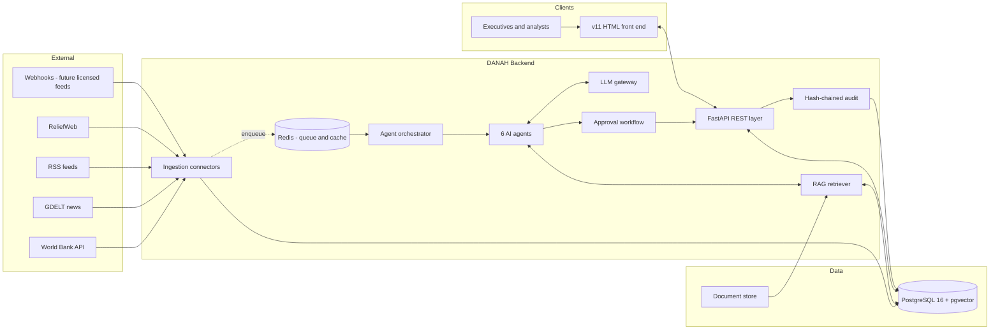
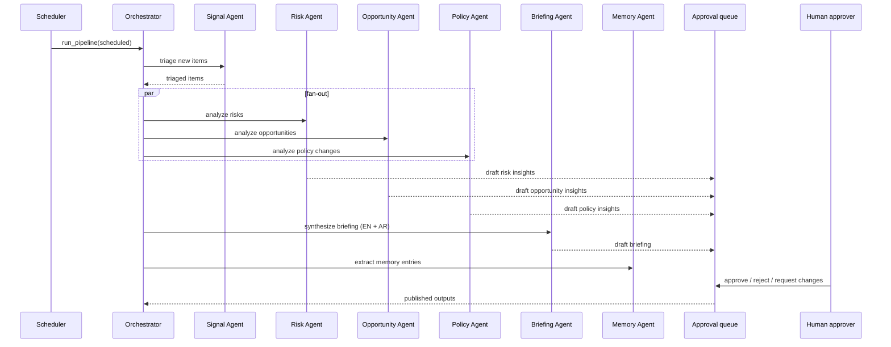
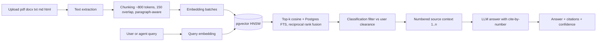
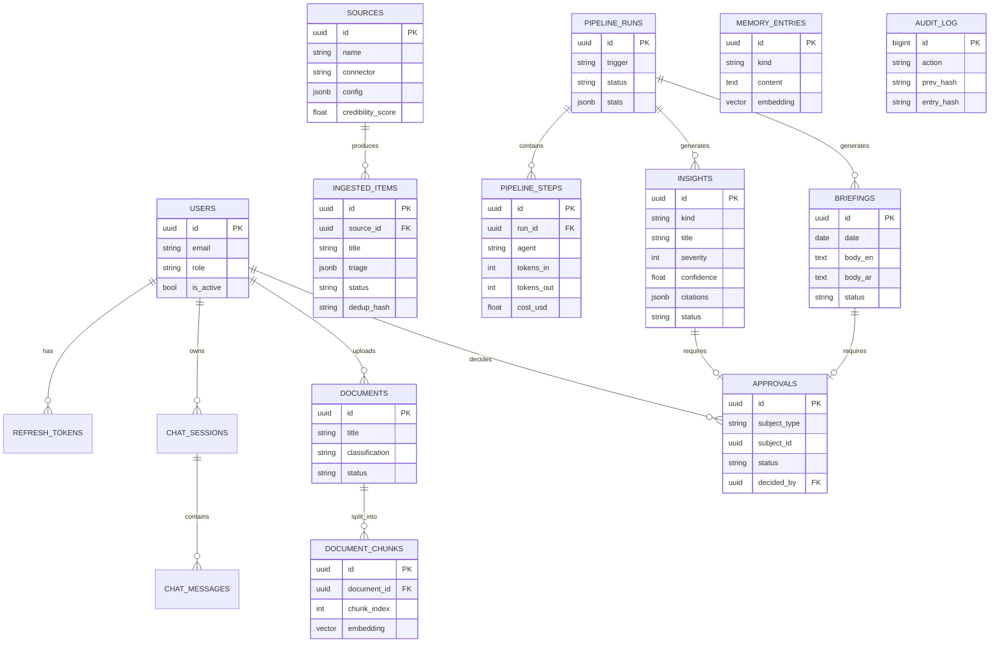

# DANAH — Developer & Architecture Document

> **Purpose:** Complete technical reference for the DANAH Strategic Intelligence Platform build. Paste this page into Notion (mermaid diagrams render natively in code blocks). Pair with `DANAH_CLAUDE_CODE_MASTER_PROMPT.md`, which contains the exact build instructions.
>
> **Status:** Approved for implementation · **Version:** 1.0 · **Owner:** Engineering

---

## 1. Executive Summary

DANAH is a strategic intelligence platform for a government ministry. It continuously ingests external signals (economic data, global news, policy announcements), analyzes them through a pipeline of specialized AI agents, and delivers grounded, cited, human-approved intelligence: risk assessments, opportunity briefs, policy watch items, and a bilingual (EN/AR) executive briefing. Executives interrogate the system through a chat assistant grounded in the ministry's own document corpus.

A complete v11 HTML front end already exists as a high-fidelity simulation. This build delivers the real backend it was designed for: API, agents, retrieval, ingestion, persistence, and server-side security suitable for OFFICIAL-SENSITIVE data.

**Core principles**
1. **Grounded or silent** — every AI output carries citations and a confidence score, or explicitly abstains.
2. **Human in the loop** — no agent output is published without an approval decision.
3. **Sovereign by default** — self-hostable stack (Postgres + pgvector, Redis); no external vector/auth SaaS.
4. **Audit everything** — hash-chained, append-only audit log covering users, agents, and system actions.
5. **Bilingual first-class** — Arabic is a product requirement, not a translation afterthought.

---

## 2. System Overview

**LLM providers:** the gateway speaks to Anthropic Claude (primary) and optionally OpenAI (fallback). Embeddings via Voyage AI or OpenAI, selected by environment configuration.

---

## 3. Architecture Layers

| Layer | Components | Responsibility |
|---|---|---|
| Client | v11 HTML app (existing) | Dashboards, chat UI, approvals UI. Integrated after backend Phase 1. |
| API | FastAPI routers, Pydantic schemas, JWT/RBAC dependencies, rate limiting, CORS | The only entry point. Enforces auth, roles, classification. ~25 endpoints. |
| Services | Auth, RAG, LLM gateway, agents, orchestrator, ingestion, approvals, memory, audit, notifications | All business logic. API layer stays thin. |
| Workers | ARQ worker + cron scheduler | Source polling, document embedding, pipeline runs, daily briefing. |
| Data | PostgreSQL 16 (+pgvector, FTS), Redis 7, file storage (local volume → S3-compatible later) | Single relational source of truth; vectors co-located for sovereignty and simplicity. |

**Why pgvector instead of a vector SaaS:** government data residency, one backup story, one security boundary, transactional consistency between chunks and metadata, and HNSW indexes are more than adequate at this corpus scale (≤ low millions of chunks).

**Why ARQ over Celery:** fully async, matches the FastAPI stack, tiny operational footprint, first-class cron.

---

## 4. Agent Architecture

Six agents, each a configured instance of `BaseAgent` = system prompt (versioned file) + allowed tools + typed output schema + model tier.

| Agent | Model tier | Input | Output | Tools |
|---|---|---|---|---|
| Signal | fast | batch of new ingested items | triage: relevance 0–1, category, urgency, rationale | none |
| Risk | primary | high-relevance items + retrieval | Risk insights: severity 1–5, likelihood, domains, actions, citations, confidence | search_knowledge_base, search_ingested_items, get_memory |
| Opportunity | primary | same as Risk | Opportunity insights (impact 1–5) | same as Risk |
| Policy | primary | regulatory-category items | Policy insights: change, jurisdictions, compliance impact, deadline | search_knowledge_base, search_ingested_items |
| Briefing | primary | day's insights + KPI snapshot | Executive briefing EN + faithful AR rendering, cited | get_kpi_snapshot, get_memory |
| Memory | fast | completed run artifacts | durable decisions/lessons → embedded memory entries | save_memory, get_memory |

**Grounding contract (all agents):** cite item/chunk ids for every claim; abstain with an explicit statement when evidence is insufficient; confidence = calibrated blend of retrieval similarity and model self-assessment (formula documented in code). **Publication contract:** agents can only create `draft` records; only a human decision on the approval record transitions anything to `published`.

---

## 5. RAG Pipeline

Design notes: chunking respects paragraphs to keep citations readable; hybrid retrieval (vector + keyword) covers exact names/numbers the embedding may miss; classification filtering happens in SQL, not in the prompt, so leakage is structurally impossible; the composer instructs the model to answer only from provided sources and to say so when they do not contain the answer.

---

## 6. Data Model (ERD)

Full column definitions live in the master prompt (Section 6) and Alembic migration 0001. Conventions: UUID keys, `created_at`/`updated_at` everywhere, classification enum `PUBLIC | INTERNAL | OFFICIAL | OFFICIAL_SENSITIVE`.

---

## 7. API Reference (summary)

Base: `/api`, JSON, Bearer JWT. Full contract with roles is Section 7.7 of the master prompt; the UI-relevant surface:

| Domain | Endpoints |
|---|---|
| Auth | `POST /auth/login` · `POST /auth/refresh` · `GET /auth/me` |
| Chat | `POST /agent/chat` (answer + citations + confidence) · `GET /agent/chat/sessions[/{id}]` |
| Knowledge | `POST/GET /knowledge/documents` · `POST /knowledge/search` |
| Sources & items | `GET/POST/PATCH /sources` · `POST /sources/{id}/sync` · `GET /items` · `POST /ingest/webhook/{source_id}` |
| Pipeline | `POST /pipeline/run` · `GET /pipeline/runs[/{id}]` (live step status, tokens, cost) |
| Insights & briefings | `GET /insights[/{id}]` · `GET /briefings[/{id}]` · `POST /briefings/generate` |
| Approvals | `GET /approvals?status=pending` · `POST /approvals/{id}/decision` |
| Dashboard | `GET /dashboard/summary` (single call powering the command centre) |
| Memory | `GET /memory` · `POST /memory/search` |
| Governance | `GET /audit` · `GET /audit/verify` · `GET /notifications` |
| Ops | `GET /healthz` · `GET /metrics` |

---

## 8. Security Architecture

**Authentication:** email+password (argon2) → JWT access (15 min) + rotating refresh (14 d, hashed at rest). OIDC/SSO integration stubbed for Phase 4 (government IdP).

**Authorization — RBAC and clearance:**

| Role | Clearance ceiling | Can |
|---|---|---|
| viewer | INTERNAL | read published outputs |
| analyst | OFFICIAL | upload docs, sync sources, trigger runs, use chat fully |
| executive | OFFICIAL_SENSITIVE | everything analysts can + approve/reject + generate briefings |
| admin | OFFICIAL_SENSITIVE | everything + manage users/sources + audit |

Classification is enforced in SQL filters at the data layer (retrieval, listings, chat grounding), never client-side.

**Audit:** append-only `audit_log` where `entry_hash = sha256(prev_hash + canonical_json(entry))`; DB trigger blocks UPDATE/DELETE; `GET /audit/verify` re-walks the chain and reports the first broken index if tampered. Actors are users, agents, or system.

**Other controls:** Redis sliding-window rate limits (login, chat); Pydantic validation on every input; parameterized queries only; secrets exclusively via env with fail-fast startup checks; document text redacted from logs at OFFICIAL+; per-source HMAC on webhook ingestion.

**Deliberately deferred to deployment hardening:** network segmentation, TLS termination, secret manager integration, SIEM forwarding, penetration test.

---

## 9. Ingestion & Connectors

| Connector | Auth | What it pulls | Config |
|---|---|---|---|
| World Bank Indicators | none | GDP, inflation, unemployment, trade for watched countries | indicator codes + `WATCH_COUNTRIES` |
| GDELT 2.0 DOC | none | global news matching query terms | `WATCH_QUERY_TERMS` |
| RSS (generic) | none | any feed list | feed URLs in source config |
| ReliefWeb | none | humanitarian/disaster reports | country filter |
| Webhook receiver | HMAC per source | future licensed feeds (Bloomberg, Reuters, FT) | shared secret |

Normalization: every connector maps to the same `ingested_items` shape with a `dedup_hash` (unique) so re-polls never duplicate. Scheduler polls per-source `poll_interval_minutes`; failures set `last_status` and surface in `GET /sources` and the dashboard. Licensed feeds later become either a new connector class or a webhook producer — no schema change required.

---

## 10. Deployment & Operations

**Development:** `docker compose up` → api (uvicorn), worker (ARQ), scheduler, postgres:16 + pgvector, redis:7. `make dev / test / lint / migrate / seed`.

**Production topology (target):** 2+ stateless API replicas behind a load balancer → managed/sovereign PostgreSQL with pgvector → Redis → 1–2 workers. Object storage (S3-compatible) for original documents. TLS at the edge. Container registry + CI running lint, mypy, tests, migration check.

**Observability:** structlog JSON with request IDs end-to-end (including inside LLM calls); Prometheus `/metrics` (request latency, error rates, LLM tokens and cost by purpose); `api_usage` table doubles as a cost ledger per model/purpose/user. **Cost controls:** fast-tier model for triage/memory, primary model only where judgment matters; per-run token budget env caps; usage visible on the dashboard.

---

## 11. Roadmap & Milestones

| Phase | Scope | Duration (2–3 eng) | Exit criterion |
|---|---|---|---|
| 0 | Skeleton: repo, config, schema migration, compose, health | 2–3 days | `make test lint` green on empty app |
| 1 | Grounded chat: auth, LLM gateway, RAG, upload, chat with citations | 3–4 weeks | PDF uploaded → cited answer about it; out-of-corpus → abstain |
| 2 | Real data + first agents: connectors, scheduler, Signal + Risk, insights API | 4–6 weeks | Real World Bank/GDELT items → grounded Risk insights with per-step cost |
| 3 | Full cycle: all 6 agents, orchestrator fan-out, approvals, bilingual briefing, memory, notifications | 6–8 weeks | Scheduled run → EN/AR briefing in approval queue → publish/reject works |
| 4 | Hardening: hash-chain audit + verify, rate limits, classification sweep, HMAC webhooks, metrics, runbook, OIDC stub | 6–8 weeks (overlaps 3) | Tamper test caught; viewer blocked from sensitive data by test; 429s enforced |

Working pilot ≈ end of Phase 2 (~2–2.5 months). Production-ready ≈ 5–6 months end to end. Client-side dependencies (data licenses, SSO details, hosting decision) tracked separately.

---

## 12. Decision Log

| # | Decision | Rationale | Alternatives rejected |
|---|---|---|---|
| 1 | Python/FastAPI | AI ecosystem, async, typing, OpenAPI | Node/Nest (weaker AI tooling) |
| 2 | pgvector in primary Postgres | sovereignty, one backup/security boundary, transactional joins | Pinecone/Weaviate (external SaaS, residency risk) |
| 3 | Custom thin agent framework over LangChain | full control of prompts/logging/audit, fewer deps, easier gov review | LangChain/LlamaIndex (abstraction churn, harder audit) |
| 4 | ARQ for jobs | async-native, tiny, cron built in | Celery (sync-first, heavier ops) |
| 5 | Anthropic primary via provider-agnostic gateway | quality + tool use; gateway keeps switching cost near zero | hard-coding one vendor |
| 6 | Human approval on all publications | government accountability requirement | auto-publish with review-after |
| 7 | Hash-chained audit in Postgres | tamper-evidence without new infra | external ledger (overkill at this stage) |

---

## 13. Risk Register

| Risk | Likelihood | Impact | Mitigation |
|---|---|---|---|
| LLM hallucination in briefings | med | high | grounding contract, cite-or-abstain, confidence scores, human approval gate |
| Open-source feed quality/noise | med | med | Signal Agent relevance threshold, credibility scores, per-source disable |
| Licensed feed procurement delay | high | med | webhook + connector abstraction ready; open sources carry the pilot |
| Cost overrun on tokens | med | med | model tiering, per-run budgets, cost ledger + dashboard visibility |
| Arabic output quality | med | med | dedicated AR rendering pass, native-speaker review in UAT, prompt guidance |
| Sovereignty/hosting constraints | med | high | fully self-hostable stack; provider gateway allows regional/sovereign LLM endpoints |
| Prompt injection via ingested content | med | high | treat item text as data in prompts, no tool escalation from content, output schema validation |

---

## 14. Glossary

**Agent** — an LLM instance with a fixed role prompt, tools, and a typed output schema. **RAG** — retrieval-augmented generation; answers grounded in retrieved document chunks. **pgvector** — Postgres extension storing embeddings for similarity search. **Grounding** — requiring every claim to trace to a cited source or be withheld. **Classification** — data sensitivity tier (PUBLIC → OFFICIAL_SENSITIVE) enforced at the data layer. **Hash chain** — audit rows where each hash includes the previous, making silent edits detectable. **Pipeline run** — one orchestrated pass of all agents over new items. **Triage** — Signal Agent's relevance/category/urgency scoring of raw items.
